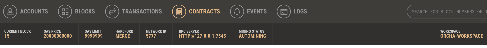
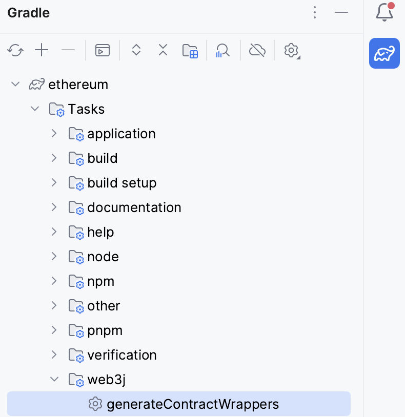
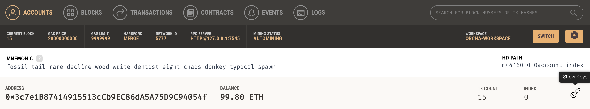

# Java Ethereum

## Ganache node

Lauch a Ganache node

Create a new workspace in order to increase the GAS limit: 



## Project configuration

Java 17 is required.

Web3j as a Gradle plugin:

```
plugins {
    id 'java'
    id 'org.springframework.boot' version '3.1.1'
    id 'io.spring.dependency-management' version '1.1.0'
    id 'org.web3j' version '4.10.0'
}
```

See https://github.com/charroux/ethereum/blob/main/build.gradle

## Solidity Smart contracts

All contracts must be in: https://github.com/charroux/ethereum/tree/main/src/main/solidity

The train selection smart contract: https://github.com/charroux/ethereum/blob/main/src/main/solidity/TrainSelection.sol

## Contract Java wrapper

Launch the gradle task: 

See the contract Java Wrapper in build/generated/sources/web3j/java

## Contract deployment and test

The main program for the deployment: https://github.com/charroux/ethereum/blob/main/src/main/java/com/charroux/ethereum/SmartContractDeployment.java

Replace PRIVATE KEY in the following line 
```
SelecTrain selecTrain = SelecTrain.deploy(web3j, Credentials.create("PRIVATE KEY"), new DefaultGasProvider()).send();
```
by one of the keys of the given accounts in Ganache (see the right side of the image):



Launch the program, then check the output and notice the displayed contract address, then replace the address in the interaction program (don't forget the account private key: 

```
SelecTrain selecTrain = SelecTrain.load("CONTRACT ADDRESS", web3j, Credentials.create("PRIVATE KEY"), new DefaultGasProvider());
```

in https://github.com/charroux/ethereum/blob/main/src/main/java/com/charroux/ethereum/SmartContractDeployment.java

Then lauch the program. 


